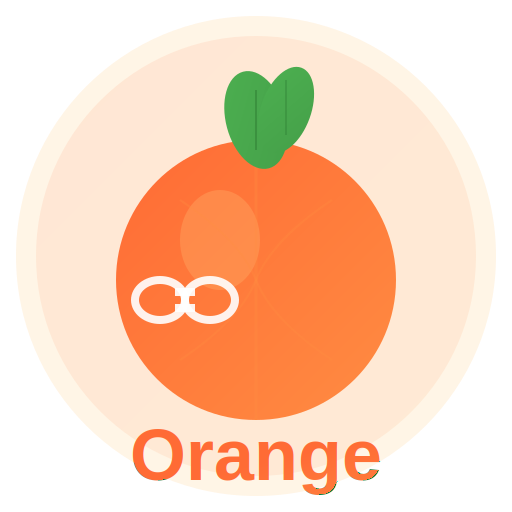
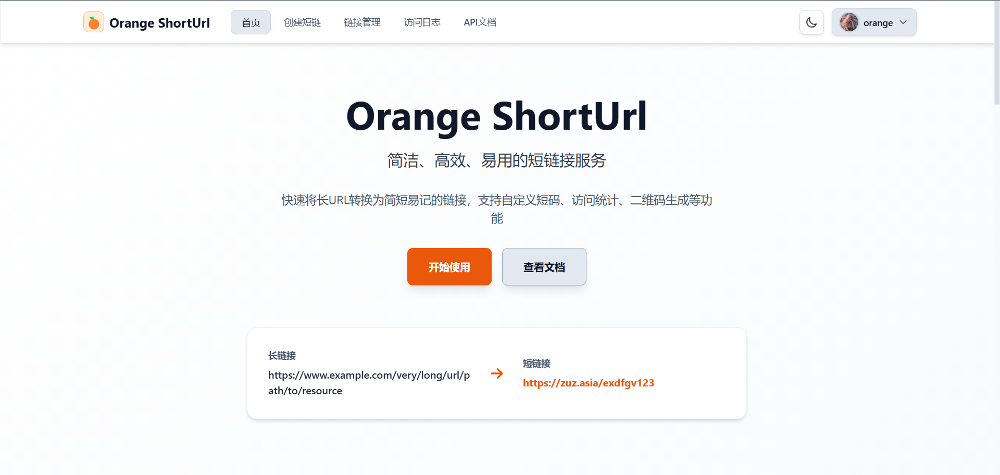
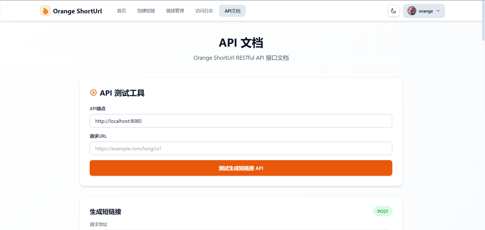

# Orange ShortUrl

<div>
  

  <p>🍊 简洁、高效、易用的短链接系统</p>
> 🔗 **Orange ShortUrl** 是一个开箱即用的、功能完整的短链接系统。它基于 **Spring Boot** + **Vue 3** + **TailwindCSS** 构建，支持短链生成、访问统计、用户认证、链接管理等功能，让你可以快速搭建自己的短链接服务。


---

## ✨ 功能特性

- 🔗 **短链生成**：快速将长URL转换为短链接，支持自定义短码和过期时间
- 🔄 **智能重定向**：访问短链接自动跳转到原始URL，支持前端重定向页面
- 📊 **访问统计**：详细记录访问次数、访问时间、IP地址、浏览器、来源等信息
- 📈 **数据分析**：可视化展示访问趋势、每日统计等数据
- 👤 **用户系统**：支持邮箱注册、OAuth登录（Linux.do）、头像上传等功能
- 🔐 **权限管理**：登录用户独享链接管理、访问日志等高级功能
- 📱 **响应式设计**：完美适配桌面端和移动端，提供一致的用户体验
- 🌗 **深色模式**：支持明暗主题切换，保护眼睛
- 💬 **用户评价**：支持用户评价系统，支持多次评价和自动滚动展示
- 🔍 **链接管理**：查看、搜索、删除自己创建的短链接
- 📄 **访问日志**：查看所有短链接的详细访问记录

### 注意：部署后需要配置数据库和邮件服务，OAuth登录需要单独配置

<details>
  <summary>点击查看项目截图</summary>
  
  
</details>

## 🗺 目录

- [技术栈](#技术栈)
- [快速开始](#快速开始)
- [部署](#部署)
- [配置说明](#配置说明)
- [环境变量](#环境变量)
- [API接口](#api接口)
- [常见问题](#常见问题)
- [开发计划](#开发计划)
- [安全与隐私提醒](#安全与隐私提醒)
- [License](#license)
- [致谢](#致谢)

## 技术栈

| 分类       | 主要依赖                                                           |
| ---------- | ------------------------------------------------------------------ |
| 后端框架   | [Spring Boot 2.7.18](https://spring.io/projects/spring-boot)      |
| 前端框架   | [Vue 3](https://vuejs.org/) · Composition API                      |
| UI & 样式  | [Tailwind CSS 3](https://tailwindcss.com/)                         |
| 数据库     | MySQL 8.0+ · MyBatis                                               |
| 缓存       | Redis                                                              |
| 构建工具   | Maven · Vite                                                       |
| 语言       | Java 8+ · JavaScript                                               |
| 其他       | JWT · QRCode.js · Axios                                            |

## 快速开始

### 环境要求

- **JDK**: 8 或更高版本
- **Maven**: 3.6 或更高版本
- **MySQL**: 8.0 或更高版本
- **Redis**: 6.0 或更高版本
- **Node.js**: 16 或更高版本
- **npm**: 8 或更高版本

### 1. 克隆项目

```bash
git clone https://github.com/djteang/orange-shorturl.git
cd orange-shorturl
```

### 2. 数据库配置

#### 创建数据库并初始化

登录MySQL，执行以下命令：

```bash
mysql -u root -p
```

然后执行数据库初始化脚本：

```sql
-- 执行基础表结构
source shorturl-backend/src/main/resources/schema.sql
```

#### 修改数据库连接配置

编辑 `shorturl-backend/src/main/resources/application.yml`，修改数据库和Redis连接信息：

```yaml
spring:
  datasource:
    url: jdbc:mysql://localhost:3306/shorturl?useUnicode=true&characterEncoding=utf8&useSSL=false&serverTimezone=Asia/Shanghai
    username: root
    password: your_password
  
  redis:
    host: localhost
    port: 6379
    password: your_redis_password  # 如果没有密码可以注释掉
```

### 3. 配置邮件服务（用于注册验证）

编辑 `shorturl-backend/src/main/resources/application.yml`：

```yaml
spring:
  mail:
    host: smtp.example.com
    port: 587
    username: your-email@example.com
    password: your-email-password
    properties:
      mail:
        smtp:
          auth: true
          starttls:
            enable: true
```

### 4. 启动后端

```bash
cd shorturl-backend
mvn clean package -DskipTests
java -jar target/shorturl-backend-1.0.0.jar
```

或使用开发模式：

```bash
mvn spring-boot:run
```

后端服务将在 `http://localhost:9003` 启动。

### 5. 启动前端

```bash
cd shorturl-frontend
npm install
npm run dev
```

前端服务将在 `http://localhost:5173` 启动。

### 6. 访问系统

打开浏览器访问：
- 前端：`http://localhost:5173`
- 后端API：`http://localhost:9003`

## 部署

本项目支持 Docker 部署和传统部署方式。

### Docker 部署（推荐）

#### 使用 Docker Compose

创建 `docker-compose.yml` 文件：

```yml
version: '3.8'

services:
  mysql:
    image: mysql:8.0
    container_name: shorturl-mysql
    restart: always
    environment:
      MYSQL_ROOT_PASSWORD: your_password
      MYSQL_DATABASE: shorturl
    volumes:
      - mysql-data:/var/lib/mysql
      - ./shorturl-backend/src/main/resources/schema.sql:/docker-entrypoint-initdb.d/1-schema.sql
      - ./shorturl-backend/src/main/resources/user-schema.sql:/docker-entrypoint-initdb.d/2-user-schema.sql
    ports:
      - "3306:3306"
    networks:
      - shorturl-network

  redis:
    image: redis:alpine
    container_name: shorturl-redis
    restart: always
    command: redis-server --requirepass your_redis_password
    ports:
      - "6379:6379"
    networks:
      - shorturl-network

  backend:
    build: ./shorturl-backend
    container_name: shorturl-backend
    restart: always
    ports:
      - "9003:9003"
    environment:
      # 数据库配置
      SPRING_DATASOURCE_URL: jdbc:mysql://mysql:3306/shorturl?useUnicode=true&characterEncoding=utf8&useSSL=false&serverTimezone=Asia/Shanghai&allowPublicKeyRetrieval=true
      SPRING_DATASOURCE_USERNAME: root
      SPRING_DATASOURCE_PASSWORD: your_password
      
      # Redis配置
      SPRING_REDIS_HOST: redis
      SPRING_REDIS_PORT: 6379
      SPRING_REDIS_PASSWORD: your_redis_password
      SPRING_REDIS_DATABASE: 0
      
      # 邮件服务配置（用于注册验证码）
      SPRING_MAIL_HOST: smtp.qq.com
      SPRING_MAIL_PORT: 465
      SPRING_MAIL_USERNAME: your-email@qq.com
      SPRING_MAIL_PASSWORD: your-email-auth-code
      SPRING_MAIL_PROPERTIES_MAIL_SMTP_AUTH: true
      SPRING_MAIL_PROPERTIES_MAIL_SMTP_SSL_ENABLE: true
      SPRING_MAIL_PROPERTIES_MAIL_SMTP_SOCKETFACTORY_CLASS: javax.net.ssl.SSLSocketFactory
      SPRING_MAIL_PROPERTIES_MAIL_SMTP_SOCKETFACTORY_PORT: 465
      
      # 应用配置
      SHORTURL_DOMAIN: https://your-domain.com
      SHORTURL_FRONTEND_URL: https://your-domain.com
      
      # OAuth配置（可选，如不使用可删除）
      OAUTH_FRONTEND_CALLBACK_URL: https://your-domain.com/oauth-callback
      OAUTH_FRONTEND_LOGIN_URL: https://your-domain.com/login
      OAUTH_LINUX_DO_CLIENT_ID: your-linuxdo-client-id
      OAUTH_LINUX_DO_CLIENT_SECRET: your-linuxdo-client-secret
      OAUTH_LINUX_DO_REDIRECT_URI: https://your-domain.com/api/auth/oauth2/linux-do/callback
      OAUTH_LINUX_DO_AUTHORIZE_URL: https://connect.linux.do/oauth2/authorize
      OAUTH_LINUX_DO_TOKEN_URL: https://connect.linux.do/oauth2/token
      OAUTH_LINUX_DO_USER_INFO_URL: https://connect.linux.do/api/user
    depends_on:
      - mysql
      - redis
    networks:
      - shorturl-network

  frontend:
    build: ./shorturl-frontend
    container_name: shorturl-frontend
    restart: always
    ports:
      - "80:80"
    depends_on:
      - backend
    networks:
      - shorturl-network

networks:
  shorturl-network:
    driver: bridge

volumes:
  mysql-data:
```

**环境变量说明：**

Spring Boot 支持通过环境变量覆盖 `application.yml` 中的配置。环境变量的命名规则是：
- 将配置项的点号（`.`）替换为下划线（`_`）
- 将短横线（`-`）替换为下划线（`_`）
- 全部使用大写字母

例如：
- `spring.datasource.url` → `SPRING_DATASOURCE_URL`
- `oauth.linux-do.client-id` → `OAUTH_LINUX_DO_CLIENT_ID`

启动服务：

```bash
docker-compose up -d
```

查看日志：

```bash
docker-compose logs -f backend
```

停止服务：

```bash
docker-compose down
```

#### 使用 .env 文件管理环境变量（推荐）

为了更方便地管理环境变量，可以从模板创建 `.env` 文件：

```bash
# 复制环境变量模板
cp env.example .env

# 编辑配置文件
vim .env  # 或使用其他编辑器
```

`.env` 文件示例：

```bash
# .env 文件
# 数据库配置
MYSQL_ROOT_PASSWORD=your_password
MYSQL_DATABASE=shorturl

# Redis配置
REDIS_PASSWORD=your_redis_password

# 邮件配置
MAIL_HOST=smtp.qq.com
MAIL_PORT=465
MAIL_USERNAME=your-email@qq.com
MAIL_PASSWORD=your-email-auth-code

# 应用配置
DOMAIN=https://your-domain.com

# OAuth配置（可选）
OAUTH_CLIENT_ID=your-linuxdo-client-id
OAUTH_CLIENT_SECRET=your-linuxdo-client-secret
```

然后修改 `docker-compose.yml` 使用这些变量：

```yml
version: '3.8'

services:
  mysql:
    image: mysql:8.0
    container_name: shorturl-mysql
    restart: always
    environment:
      MYSQL_ROOT_PASSWORD: ${MYSQL_ROOT_PASSWORD}
      MYSQL_DATABASE: ${MYSQL_DATABASE}
    volumes:
      - mysql-data:/var/lib/mysql
      - ./shorturl-backend/src/main/resources/schema.sql:/docker-entrypoint-initdb.d/1-schema.sql
    ports:
      - "3306:3306"
    networks:
      - shorturl-network

  redis:
    image: redis:alpine
    container_name: shorturl-redis
    restart: always
    command: redis-server --requirepass ${REDIS_PASSWORD}
    ports:
      - "6379:6379"
    networks:
      - shorturl-network

  backend:
    build: ./shorturl-backend
    container_name: shorturl-backend
    restart: always
    ports:
      - "9003:9003"
    environment:
      SPRING_DATASOURCE_URL: jdbc:mysql://mysql:3306/${MYSQL_DATABASE}?useUnicode=true&characterEncoding=utf8&useSSL=false&serverTimezone=Asia/Shanghai&allowPublicKeyRetrieval=true
      SPRING_DATASOURCE_USERNAME: root
      SPRING_DATASOURCE_PASSWORD: ${MYSQL_ROOT_PASSWORD}
      SPRING_REDIS_HOST: redis
      SPRING_REDIS_PORT: 6379
      SPRING_REDIS_PASSWORD: ${REDIS_PASSWORD}
      SPRING_MAIL_HOST: ${MAIL_HOST}
      SPRING_MAIL_PORT: ${MAIL_PORT}
      SPRING_MAIL_USERNAME: ${MAIL_USERNAME}
      SPRING_MAIL_PASSWORD: ${MAIL_PASSWORD}
      SHORTURL_DOMAIN: ${DOMAIN}
      SHORTURL_FRONTEND_URL: ${DOMAIN}
      OAUTH_FRONTEND_CALLBACK_URL: ${DOMAIN}/oauth-callback
      OAUTH_FRONTEND_LOGIN_URL: ${DOMAIN}/login
      OAUTH_LINUX_DO_CLIENT_ID: ${OAUTH_CLIENT_ID}
      OAUTH_LINUX_DO_CLIENT_SECRET: ${OAUTH_CLIENT_SECRET}
      OAUTH_LINUX_DO_REDIRECT_URI: ${DOMAIN}/api/auth/oauth2/linux-do/callback
    depends_on:
      - mysql
      - redis
    networks:
      - shorturl-network

  frontend:
    build: ./shorturl-frontend
    container_name: shorturl-frontend
    restart: always
    ports:
      - "80:80"
    depends_on:
      - backend
    networks:
      - shorturl-network

networks:
  shorturl-network:
    driver: bridge

volumes:
  mysql-data:
```

**注意：** 请将 `.env` 文件添加到 `.gitignore` 中，避免敏感信息泄露。

### 传统部署

#### 后端部署

##### 方式一：传统 JAR 包部署

1. **打包项目**

```bash
cd shorturl-backend
mvn clean package -DskipTests
```

2. **上传到服务器**

将 `target/shorturl-backend-1.0.0.jar` 和配置文件上传到服务器。

3. **配置生产环境**

创建 `application-prod.yml`：

```yaml
server:
  port: 9003

spring:
  datasource:
    url: jdbc:mysql://your-db-host:3306/shorturl
    username: your-username
    password: your-password
  
  redis:
    host: your-redis-host
    port: 6379
    password: your-redis-password

shorturl:
  domain: https://your-domain.com
```

4. **启动服务**

```bash
# 后台运行
nohup java -jar shorturl-backend-1.0.0.jar --spring.profiles.active=prod > app.log 2>&1 &

# 或使用 systemd 管理（推荐）
# 创建 /etc/systemd/system/orange-shorturl.service 文件
sudo systemctl start orange-shorturl
sudo systemctl enable orange-shorturl
```

#### 前端部署

1. **修改API地址**

编辑 `shorturl-frontend/src/api/index.js`：

```javascript
const api = axios.create({
  baseURL: 'https://your-api-domain.com/api',
  timeout: 10000
})
```

2. **构建项目**

```bash
cd shorturl-frontend
npm run build
```

3. **部署到Nginx**

Nginx配置示例：

```nginx
server {
    listen 80;
    server_name your-domain.com;
    
    # 前端静态文件
    location / {
        root /path/to/dist;
        try_files $uri $uri/ /index.html;
    }
    
    # 后端API代理
    location /api {
        proxy_pass http://localhost:9003;
        proxy_set_header Host $host;
        proxy_set_header X-Real-IP $remote_addr;
        proxy_set_header X-Forwarded-For $proxy_add_x_forwarded_for;
    }
    
    # 短链重定向
    location ~ ^/[a-zA-Z0-9]+$ {
        proxy_pass http://localhost:9003;
    }
}
```

## 配置说明

### 短链域名配置

在 `application.yml` 中配置短链接的域名：

```yaml
shorturl:
  domain: https://your-domain.com  # 生产环境域名
  # domain: http://localhost:5173  # 开发环境域名
```

### OAuth登录配置（可选）

如需启用Linux.do OAuth登录，需要在 `application.yml` 中配置：

```yaml
oauth:
  linuxdo:
    client-id: your-client-id
    client-secret: your-client-secret
    redirect-uri: https://your-domain.com/oauth-callback
```

### 邮件服务配置

用于用户注册时的邮箱验证：

```yaml
spring:
  mail:
    host: smtp.example.com
    port: 587
    username: your-email@example.com
    password: your-email-password
    properties:
      mail:
        smtp:
          auth: true
          starttls:
            enable: true
            required: true
        timeout: 5000
        connection-timeout: 5000
```

## 环境变量

Spring Boot 支持通过环境变量覆盖 `application.yml` 中的配置。

### 核心配置

| 变量                              | 说明                   | 默认值                  | 必填 |
| --------------------------------- | ---------------------- | ----------------------- | ---- |
| SERVER_PORT                       | 后端服务端口           | 9003                    | 否   |
| SPRING_DATASOURCE_URL             | 数据库连接URL          | -                       | ✅ 是 |
| SPRING_DATASOURCE_USERNAME        | 数据库用户名           | root                    | ✅ 是 |
| SPRING_DATASOURCE_PASSWORD        | 数据库密码             | -                       | ✅ 是 |
| SPRING_REDIS_HOST                 | Redis主机地址          | localhost               | ✅ 是 |
| SPRING_REDIS_PORT                 | Redis端口              | 6379                    | 否   |
| SPRING_REDIS_PASSWORD             | Redis密码              | -                       | 建议设置 |
| SPRING_REDIS_DATABASE             | Redis数据库索引        | 0                       | 否   |

### 应用配置

| 变量                              | 说明                   | 默认值                  | 必填 |
| --------------------------------- | ---------------------- | ----------------------- | ---- |
| SHORTURL_DOMAIN                   | 短链接域名             | http://localhost:9003   | 建议设置 |
| SHORTURL_FRONTEND_URL             | 前端URL                | http://localhost:5173   | 建议设置 |

### 邮件配置（注册验证需要）

| 变量                              | 说明                   | 默认值                  | 必填 |
| --------------------------------- | ---------------------- | ----------------------- | ---- |
| SPRING_MAIL_HOST                  | 邮件服务器地址         | -                       | ✅ 是 |
| SPRING_MAIL_PORT                  | 邮件服务器端口         | 587                     | 否   |
| SPRING_MAIL_USERNAME              | 邮件服务器用户名       | -                       | ✅ 是 |
| SPRING_MAIL_PASSWORD              | 邮件服务器密码/授权码  | -                       | ✅ 是 |

### OAuth 配置（可选）

| 变量                                  | 说明                       | 必填 |
| ------------------------------------- | -------------------------- | ---- |
| OAUTH_FRONTEND_CALLBACK_URL           | 前端OAuth回调地址          | 否   |
| OAUTH_FRONTEND_LOGIN_URL              | 前端登录页地址             | 否   |
| OAUTH_LINUX_DO_CLIENT_ID              | Linux.do OAuth客户端ID     | 否   |
| OAUTH_LINUX_DO_CLIENT_SECRET          | Linux.do OAuth密钥         | 否   |
| OAUTH_LINUX_DO_REDIRECT_URI           | OAuth回调URI               | 否   |

**环境变量命名规则：**
- 配置项的点号（`.`）替换为下划线（`_`）
- 短横线（`-`）替换为下划线（`_`）
- 全部使用大写字母

**示例：**
- `spring.datasource.url` → `SPRING_DATASOURCE_URL`
- `oauth.linux-do.client-id` → `OAUTH_LINUX_DO_CLIENT_ID`

详细配置说明请参考：[DOCKER-DEPLOYMENT.md](DOCKER-DEPLOYMENT.md)

## API接口

### 短链接相关

#### 生成短链接

```
POST /api/url/shorten
Content-Type: application/json
Authorization: Bearer <token>  # 可选

{
  "originalUrl": "https://example.com/very/long/url",
  "customCode": "abc123",  # 可选，自定义短码
  "expireTime": "2025-12-31 23:59:59"  # 可选，过期时间
}
```

#### 短链重定向

```
GET /{shortCode}
```

#### 获取链接列表

```
GET /api/url/list?page=1&size=10&keyword=
Authorization: Bearer <token>
```

#### 获取链接详情

```
GET /api/url/detail/{shortCode}
Authorization: Bearer <token>
```

#### 删除链接

```
DELETE /api/url/{shortCode}
Authorization: Bearer <token>
```

#### 获取访问统计

```
GET /api/url/stats/{shortCode}
Authorization: Bearer <token>
```

### 用户相关

#### 用户注册

```
POST /api/user/register
Content-Type: application/json

{
  "username": "user",
  "email": "user@example.com",
  "password": "password",
  "verifyCode": "123456"
}
```

#### 用户登录

```
POST /api/user/login
Content-Type: application/json

{
  "username": "user",
  "password": "password"
}
```

#### 获取用户信息

```
GET /api/user/info
Authorization: Bearer <token>
```

### 访问日志

#### 获取访问日志列表

```
GET /api/visit-log/list?page=1&size=10&shortCode=
Authorization: Bearer <token>
```

## 常见问题

### 1. 数据库连接失败

- 检查MySQL是否启动
- 确认数据库连接信息是否正确
- 确保MySQL允许远程连接（如果是远程数据库）
- 检查防火墙是否开放3306端口

### 2. Redis连接失败

- 检查Redis是否启动
- 确认Redis连接信息是否正确
- 如果Redis设置了密码，确保配置了正确的密码

### 3. 前端无法访问后端API

- 检查后端服务是否正常启动
- 确认CORS配置是否正确
- 检查防火墙是否开放了9003端口
- 确认前端API地址配置正确

### 4. 短链接重定向失败

- 确认数据库中存在该短码记录
- 检查链接是否已过期
- 查看后端日志排查错误

### 5. 邮件发送失败

- 确认邮件服务器配置正确
- 检查邮箱账号密码是否正确
- 某些邮箱需要开启SMTP服务并使用授权码

### 6. OAuth登录失败

- 确认OAuth客户端ID和密钥配置正确
- 检查回调地址是否正确配置
- 查看后端日志获取详细错误信息

## 开发计划

- [x] 短链接生成和重定向
- [x] 访问统计和数据分析
- [x] 用户系统（注册、登录、OAuth）
- [x] 链接管理功能
- [x] 访问日志查询
- [x] 用户评价系统
- [x] 深色模式
- [x] 响应式设计
- [ ] 批量生成短链接
- [ ] 链接分组功能
- [ ] 更多访问统计维度（地域、设备等）
- [ ] 支持自定义域名
- [ ] 二维码样式自定义
- [ ] API限流和防滥用
- [ ] 数据导出功能

## 安全与隐私提醒

### 请妥善保管数据库和配置信息

为了您的安全和避免潜在的安全风险，我们建议：

### 部署要求

1. **修改默认密码**：务必修改数据库、Redis等服务的默认密码
2. **使用HTTPS**：生产环境建议使用HTTPS保护数据传输安全
3. **定期备份**：定期备份数据库，防止数据丢失
4. **限制访问**：合理配置防火墙规则，只开放必要的端口
5. **安全审计**：定期检查系统日志，发现异常及时处理

### 重要声明

- 本项目仅供学习和个人使用
- 请勿将短链接服务用于非法用途
- 请遵守当地法律法规
- 项目开发者不对用户的使用行为承担任何法律责任
- 请合理使用资源，避免滥用

## License

[MIT](LICENSE) © 2025 Orange ShortUrl & Contributors

## 致谢

- [Spring Boot](https://spring.io/projects/spring-boot) — 提供强大的后端框架
- [Vue.js](https://vuejs.org/) — 提供优秀的前端框架
- [Tailwind CSS](https://tailwindcss.com/) — 提供现代化的CSS框架
- [MyBatis](https://mybatis.org/) — 提供灵活的持久层框架
- [QRCode.js](https://github.com/davidshimjs/qrcodejs) — 提供二维码生成功能

## Star History

如果这个项目对你有帮助，欢迎给个 Star ⭐️

---

**享受使用 Orange ShortUrl！** 🍊🔗
